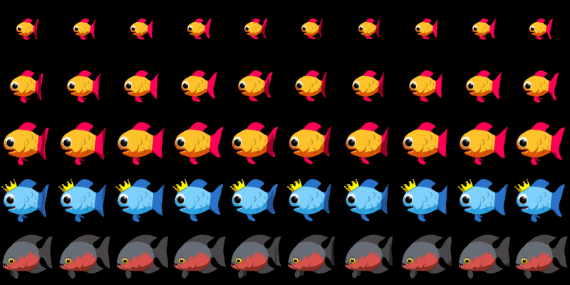
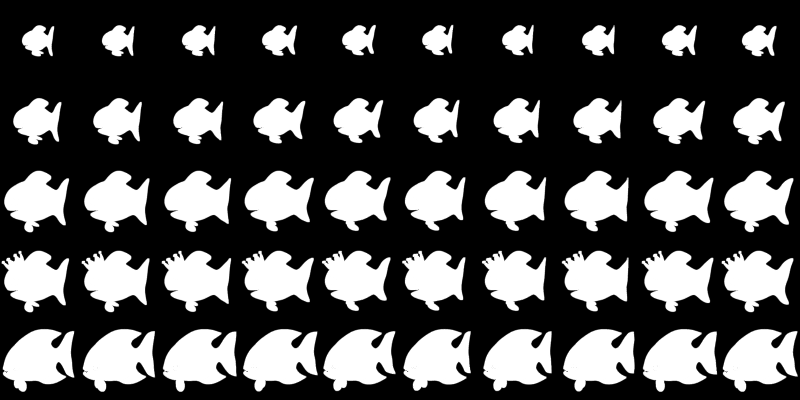

# Insaniquarium

Remake of the popular PopCap (now EA) game [Insaniquarium](https://store.steampowered.com/app/3320/Insaniquarium_Deluxe/). In this game you manage an aquarium with fish that you feed, in reward the fish drop coins that can buy you upgrades, more fish and pets. Once in a while the tank will be attacked by aliens that you need to defeat to keep your fish safe.


## Gameplay

- Each level you start with two small fish. When clicking the mouse you can drop food. After eating x amount of the food the fish grow. When the fish grow bigger they start dropping coins. 

- The coins are used to buy upgrades (better food, more food you can drop at once, etc) or other fish such as the carnivore which is a fish that eats small fishes.

- When fish go without food for a period, they first become hungry, actively searching for food. If they continue to be unfed, they become sick, and if the situation persists with no food provided, they eventually die.

- Aliens spawn periodically, with different types appearing in each level. Players must defeat these aliens, who attempt to attack the fish. If all the fish perish due to starvation or alien attacks, the game ends.

- Each level concludes when the player purchases three shell pieces to form an egg. After completing a level, the player is rewarded with a new pet that hatches from the egg.


## Rendering


In the original version of the game, the artwork files were not protected, allowing users to access the GIF files. These files consist of two parts: a regular image file and a corresponding mask file. To utilize the images, these two files need to be combined, enabling users to extract the desired image by overlaying the mask. This happens in [GameImage.java](./src/main/java/insaniquarium/game/GameImage.java).

<div style="display: flex; justify-content: space-between;">
    
    
</div>
<br></br>

In the context of image processing, images are often represented using 32-bit integers, where each byte of the integer represents a different color channel: Alpha (transparency), Red, Green, and Blue (ARGB). In this representation, the alpha channel determines how transparent a pixel is, and the RGB channels represent the color of the pixel.

```java
int masked = (imageOriginal.getRGB(x, y) & 0x00FFFFFF ) | (mask.getRGB(x, y) << 24);
```
In the given code, there are two images: the original image and the corresponding mask image. The goal is to combine the mask's alpha channel with the RGB values of the original image. Here's how it's done:

1. Extracting Masked Alpha Values: mask.getRGB(x, y) << 24. Note that a back pixel 0XFFFFFFFF becomes 0XFF000000 after the shift operation.
2. Preserving Original RGB Values: imageOriginal.getRGB(x, y) & 0x00FFFFFF
3. Combining Alpha Channel and RGB Values with the or | operation.


## Collision 

A naive approach would be to compare each entity with each other. This however would mean comparing n x n elements and is $O(n^2)$ complexity.

A better way is to use spatial partitioning data structures such as a kd-tree which divides the space into smaller spaces which reduces the compares.smaller sections, significantly reducing the number of necessary comparisons. The average time complexity of building a kd-tree is $O(n*log(n))$ and searching in a balanced kd-tree is $O(log(n))$.

## Sound


In the game, both the music and sound effects are openly accessible. The music tracks are stored in the .mo3 format, while the sound effects are saved in .ogg format. To play these audio elements, the game employs the [NativeBass library](http://jerome.jouvie.free.fr/nativebass/index.php).

Notably, each music track has a designated starting point defined in the [Soundmanager.java](./src/main/java/insaniquarium/game/SoundManager.java) file. When a song reaches its end, the playback pointer loops back to the specified offset byte, effectively replaying the song from that position.


## Limitations

The provided [GameEntity.java](./src/main/java/insaniquarium/game/gamesystem/GameEntity.java) represents a basic game entity system that handles various game objects such as fishes, aliens, food, and money. While the current implementation works for the existing entities, it faces limitations as the complexity of the game increases and more entities and behaviors are added. 


A more modern approach to game development involves utilizing an Entity Component System (ECS) design pattern. This pattern enhances flexibility and reusability in game architectures. An example implementation of ECS can be explored in the project [InaniquariumECS](https://github.com/Jsteem/InsaniquariumECS).

